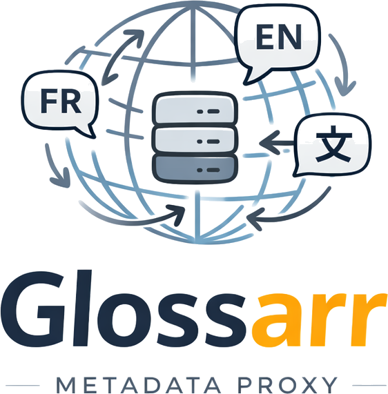

<p align="center">
  
</p>

<h1 align="center">Glossarr</h1>

<p align="center">
  Translate Sonarr's show, season, and episode metadata into your language — transparently.
</p>

<p align="center">
  <a href="LICENSE"></a>
  
  
  
</p>

---

Sonarr fetches TV metadata from Skyhook, which is almost exclusively in English. **Glossarr** is a lightweight HTTP/HTTPS proxy that sits transparently between Sonarr and Skyhook, intercepts metadata requests, and replaces titles and overviews with translations from [TVDB](https://thetvdb.com) and/or [TMDB](https://www.themoviedb.org) — for shows, seasons, and episodes.

## Features

- Translates **show**, **season**, and **episode** metadata (title + overview)
- Supports **TVDB** and **TMDB** as translation sources, with automatic field-level fallback
- Granular per-field control: `always`, `never`, or `native` (translate only if the show's original language matches yours)
- Dual-source support: fetch from both TVDB and TMDB in parallel, merge field by field
- **Anime support** via [AniList](https://anilist.co) and/or [Kitsu](https://kitsu.io) — dedicated sources with their own language setting, auto-detected via the [anime-lists](https://github.com/Fribb/anime-lists) mapping
- Zero npm dependencies — plain Node.js 20
- Transparent passthrough for all other Skyhook routes

## Security

Glossarr has **zero npm dependencies**. There is no `node_modules`, no third-party package to audit, and no supply chain attack surface. The entire codebase is a single `proxy.js` file and a few shell scripts — readable end to end in a few minutes.

If you're evaluating whether to run this on your homelab, that's the shortest security audit you'll ever do.

## How it works

Sonarr connects to `skyhook.sonarr.tv` over HTTPS to fetch metadata. Glossarr intercepts this traffic by:

1. Overriding DNS resolution for `skyhook.sonarr.tv` inside Sonarr's container (via `extra_hosts`)
2. Serving a TLS endpoint using a self-signed certificate issued by a custom CA
3. Making Sonarr trust that CA

Glossarr then forwards the request to the real Skyhook, enriches the response with translations, and returns it transparently.

## Prerequisites

- Docker & Docker Compose
- A free [TVDB API key](https://thetvdb.com/api-information) — required if using TVDB
- A free [TMDB Read Access Token](https://www.themoviedb.org/settings/api) — required if using TMDB
- `openssl` — to generate TLS certificates

## Installation

### 1. Clone the repository

```bash
git clone https://github.com/Gros-Jambon-Fr/Glossarr.git
cd Glossarr
```

### 2. Generate TLS certificates

Run the provided script to generate a custom CA and a server certificate for `skyhook.sonarr.tv`:

```bash
bash generate-certs.sh
```

This creates a `certs/` directory containing:

| File | Description |
|---|---|
| `certs/ca.crt` | The CA certificate — mount this into Sonarr so it trusts Glossarr |
| `certs/server.crt` | The server certificate used by Glossarr |
| `certs/server.key` | The server private key |

> The certificates are valid for 10 years. Regenerate them at any time by running the script again.

### 3. Configure environment variables

```bash
cp .env.example .env
```

Edit `.env` with your values. At minimum, set your API key(s) and language:

```env
TVDB_API_KEY=your_tvdb_api_key
TMDB_API_KEY=your_tmdb_api_key
LANGUAGE=fra
```

See the [Configuration](#configuration) section for all available options.

### 4. Start Glossarr

```bash
docker compose up -d
```

Glossarr listens on:
- Port `3000` — HTTP (healthcheck)
- Port `443` — HTTPS (Sonarr traffic, via `GLOSSARR_PORT=443` in the provided `docker-compose.yml`)

### 5. Integrate with Sonarr

Add the following to your Sonarr `docker-compose.yml`:

```yaml
extra_hosts:
  - "skyhook.sonarr.tv:<your_host_ip>"
volumes:
  - /path/to/Glossarr/certs/ca.crt:/custom-cont-init.d/glossarr-ca.crt:ro
  - /path/to/Glossarr/trust-glossarr-ca.sh:/custom-cont-init.d/trust-glossarr-ca.sh:ro
```

Replace `<your_host_ip>` with the IP address of the host running Glossarr (the machine where port 443 is exposed).

Then restart Sonarr:

```bash
docker compose restart sonarr
```

Sonarr will now route all Skyhook requests through Glossarr.

> **Note:** The `custom-cont-init.d` mechanism is supported by [linuxserver/sonarr](https://docs.linuxserver.io/images/docker-sonarr/). If you use a different image, trust the CA according to that image's documentation.

> **Port 443 conflict:** If port 443 is already in use on your host (e.g. by a reverse proxy), see [Advanced: TCP passthrough](#advanced-tcp-passthrough).

## Anime support

Glossarr has first-class support for anime. It automatically detects anime shows using the [Fribb/anime-lists](https://github.com/Fribb/anime-lists) mapping — a community-maintained project that maps TVDB IDs to AniList, Kitsu, AniDB, MAL, and more. All credit for this mapping goes to its contributors.

When a show is detected as anime, Glossarr can route it through dedicated anime sources instead of TVDB/TMDB:

- **[AniList](https://anilist.co)** — free, no API key required, supports English and Japanese
- **[Kitsu](https://kitsu.io)** — free, no API key required, supports English and Japanese

Both sources are fetched at the show level. Seasons and episodes continue to use TVDB/TMDB (AniList and Kitsu do not provide episode-level translations), but with the anime language applied.

**Fallback chain for anime:**

1. `ANIME_PRIMARY_SOURCE` in `ANIME_LANGUAGE`
2. `ANIME_SECONDARY_SOURCE` in `ANIME_LANGUAGE`
3. TVDB/TMDB in `LANGUAGE` (global fallback)
4. AniList/Kitsu in English (guaranteed — Skyhook is never used for detected anime)

> If `ANIME_PRIMARY_SOURCE` and `ANIME_SECONDARY_SOURCE` are not set, all shows — including anime — use the standard `PRIMARY`/`SECONDARY` sources. Anime detection has no effect.

The anime mapping is downloaded from GitHub at container startup and cached in memory. To refresh it, restart the container.

## Configuration

All configuration is done via environment variables passed to the Glossarr container.

### API Keys

| Variable | Required | Description |
|---|---|---|
| `TVDB_API_KEY` | If using TVDB | TVDB v4 API key |
| `TMDB_API_KEY` | If using TMDB | TMDB Read Access Token |

### Language

| Variable | Default | Description |
|---|---|---|
| `LANGUAGE` | `fra` | Target language as ISO 639-2 code (`fra`, `eng`, `spa`, `deu`, `ita`, `jpn`, `kor`…) |

### Translation sources

| Variable | Default | Values | Description |
|---|---|---|---|
| `PRIMARY_TRANSLATION_SOURCE` | `tvdb` | `tvdb`, `tmdb` | Primary source for translations |
| `SECONDARY_TRANSLATION_SOURCE` | _(none)_ | `tvdb`, `tmdb` | Fallback source if a field is missing from the primary |

When both sources are configured, Glossarr fetches from both in parallel and merges results field by field — title and overview are resolved independently.

### Translation modes

Each field can be controlled independently:

| Variable | Default | Description |
|---|---|---|
| `SHOW_TITLE_MODE` | `native` | Show title |
| `SHOW_OVERVIEW_MODE` | `always` | Show overview |
| `SEASON_TITLE_MODE` | `native` | Season name |
| `SEASON_OVERVIEW_MODE` | `always` | Season overview |
| `EPISODE_TITLE_MODE` | `native` | Episode title |
| `EPISODE_OVERVIEW_MODE` | `always` | Episode overview |

Available modes:

| Mode | Behavior |
|---|---|
| `always` | Always replace with the translated value |
| `never` | Never replace — keep the original Skyhook value |
| `native` | Replace only if the show's original language matches your configured `LANGUAGE` |

> **Example:** With `LANGUAGE=fra` and `SHOW_TITLE_MODE=native`, a French show like *Les Revenants* will have its title translated, but *Breaking Bad* will keep its original title.

### Anime sources

Glossarr can detect anime automatically using the [Fribb/anime-lists](https://github.com/Fribb/anime-lists) mapping (loaded at startup) and route them through dedicated sources — [AniList](https://anilist.co) and/or [Kitsu](https://kitsu.io) — instead of TVDB/TMDB.

Both sources are free and require no API key.

| Variable | Default | Values | Description |
|---|---|---|---|
| `ANIME_PRIMARY_SOURCE` | _(none)_ | `anilist`, `kitsu` | Primary source for anime translations |
| `ANIME_SECONDARY_SOURCE` | _(none)_ | `anilist`, `kitsu` | Fallback anime source if a field is missing from the primary |
| `ANIME_LANGUAGE` | _(uses `LANGUAGE`)_ | `eng`, `jpn` | Language for anime sources. AniList and Kitsu only support English and Japanese — for any other language, Glossarr falls back to TVDB/TMDB automatically. |

**How it works:**

- If a show's TVDB ID is found in the anime-lists mapping, it is considered anime.
- Anime shows use the `ANIME_*` sources and language for **all fields** (show, seasons, episodes).
- If `ANIME_LANGUAGE` is not supported by AniList/Kitsu (e.g. `fra`), those sources return nothing and Glossarr falls back to TVDB/TMDB with the global `LANGUAGE`.
- If no anime sources are configured, all shows (including anime) use the standard `PRIMARY`/`SECONDARY` sources.
- For anime, Skyhook is never used as a final fallback — AniList/Kitsu defaults (English) are always preferred.

> **Example:** With `LANGUAGE=fra`, `ANIME_PRIMARY_SOURCE=anilist`, `ANIME_LANGUAGE=eng` — regular shows get French metadata from TVDB/TMDB, anime gets English metadata from AniList.

### TLS

| Variable | Default | Description |
|---|---|---|
| `CERT_DIR` | _(none)_ | Path inside the container to the directory containing `server.crt` and `server.key`. Set automatically by the provided `docker-compose.yml`. |
| `GLOSSARR_PORT` | `3443` | HTTPS port Glossarr listens on. Set to `443` to expose Glossarr directly on the standard HTTPS port (useful when no reverse proxy is involved). |

## Health check

```
GET /health
```

```json
{ "status": "ok", "language": "fra", "primary": "tvdb", "secondary": "tmdb", "anime_primary": "anilist", "anime_secondary": null, "anime_language": "eng" }
```

## Advanced: TCP passthrough

If port 443 is already in use on your host (e.g. by Traefik or nginx), you can configure your reverse proxy to forward TCP traffic for `skyhook.sonarr.tv` directly to Glossarr's HTTPS port, without TLS termination.

**Example with Traefik** (`dynamic.yml`):

```yaml
tcp:
  routers:
    skyhook:
      entryPoints:
        - websecure
      rule: HostSNI(`skyhook.sonarr.tv`)
      service: skyhook
      tls:
        passthrough: true
  services:
    skyhook:
      loadBalancer:
        servers:
          - address: glossarr:3443
```

In this case, remove the `ports: ["443:3443"]` mapping from Glossarr's `docker-compose.yml` and make sure Glossarr is on the same Docker network as Traefik.

## License

MIT — see [LICENSE](LICENSE)
